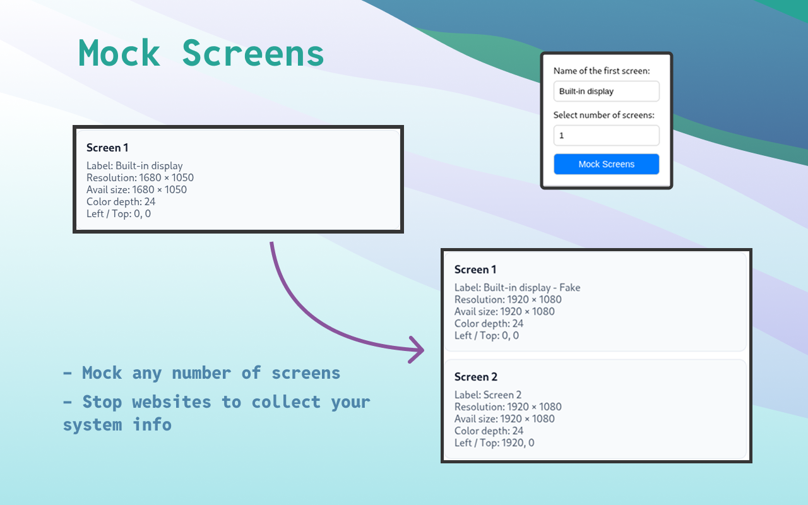

# Mock Screens

<div align="center">

</div>

Mock Screens is a browser extension built using TypeScript, and Vite. This project aims to enhance user experience by injecting custom scripts and overriding specific browser behaviors. It includes a popup UI for user interactions and integrates seamlessly with modern web technologies.

> [!WARNING]
> Firefox support is currently unavailable as `window.getScreenDetails` is not yet supported in Firefox. For more details, visit [can i use](https://caniuse.com/mdn-api_window_getscreendetails).



## Features
- **Content Script Injection**: Dynamically inject scripts into web pages.
- **Custom UI**: A popup interface for user actions.
- **Browser Compatibility**: Designed to work with modern browsers.
- **TypeScript Support**: Ensures type safety and better developer experience.
- **Vite for Development**: Fast and optimized development environment.

## Installation

1. Clone the repository:
   ```bash
   git clone https://github.com/prastavna/mock-screens.git
   ```

2. Navigate to the project directory:
   ```bash
   cd mock-screens
   ```

3. Install dependencies:
   ```bash
   bun install
   ```

4. Build the project:
   ```bash
   bun run build
   ```

5. Load the extension in your browser:
   - Open your browser's extensions page.
   - Enable "Developer mode".
   - Click "Load unpacked" and select the `dist` directory.

## Usage
- After loading the extension, click on the extension icon in the browser toolbar to open the popup.
- Use the popup interface to interact with the extension's features.

## Contributing
Contributions are welcome! Please follow these steps:

1. Fork the repository.
2. Create a new branch for your feature or bug fix:
   ```bash
   git checkout -b feature-name
   ```
3. Commit your changes:
   ```bash
   git commit -m "Add new feature"
   ```
4. Push to your branch:
   ```bash
   git push origin feature-name
   ```
5. Open a pull request.

## License
This project is licensed under the MIT License. See the LICENSE file for details.

---

Made with ❤️ by [Prastavna](www.prastavna.com)